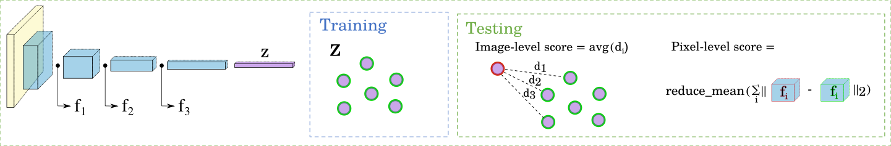
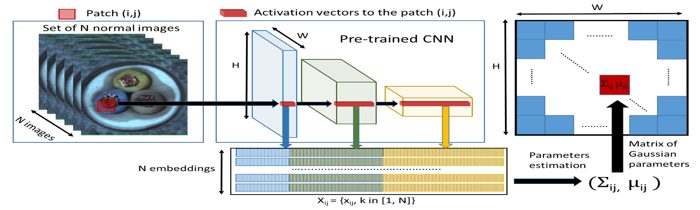
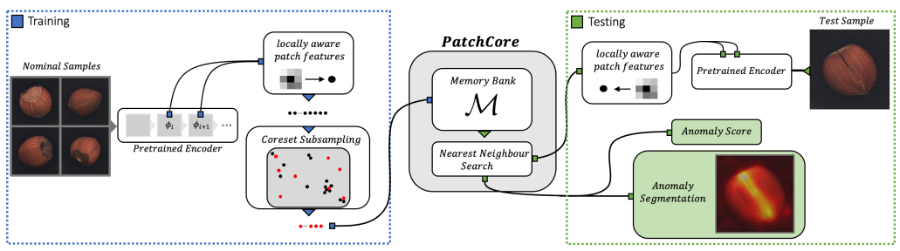

## SPADE

[ind_knn_ad](https://github.com/rvorias/ind_knn_ad/tree/master)より

##### 特徴

- 特徴抽出部分(CNN)の学習が不要
- 画像レベルで異常検知を行い、その後ピクセルレベルの異常位置セグメンテーションを行う。異常個所をセグメントできるのが新規性（[blog記事](https://tech.anytech.co.jp/entry/2023/03/22/100000), [Qiita記事](https://qiita.com/h1day/items/e65d840e557a14cf1a37)）
- [2020年の論文](https://arxiv.org/abs/2005.02357)

##### 学習・推論

- 学習は正常画像のみを使用。画像を学習済みのCNNに通し、正常画像群の特徴ベクトルを保持する
- 推論時も画像を学習済みのCNNに通し、**KNNで近傍の正常画像の特徴ベクトルk個との平均距離（l2距離）を異常度**として算出
- pixelレベルの異常位置セグメンテーションは中間層の特徴テンソルから出す

##### ind_knn_adでのハイパーパラメータ

- **k: KNNで使う近傍の数**
- **backbone_name: 特徴抽出で用いるtimmのモデル名**

## 

## PaDiM

[ind_knn_ad](https://github.com/rvorias/ind_knn_ad/tree/master)より

##### 特徴

- 特徴抽出部分(CNN)の学習が不要

- [blog記事](https://tech.anytech.co.jp/entry/2023/03/23/100000)より
  
  - PaDiMは、SPADEとは逆でpixelレベルの異常位置セグメンテーションを前段に行き、後段に画像レベルの異常検知を行う
  - 最終層の特徴ベクトルは使用せず、中間層の特徴テンソルのみを使用
  - 異常スコアはマハラノビス距離
  - **パッチごとに処理するため、左右上下のズレや、アングルの違い等があると、高い精度が発揮されない**
  - **その為、PaDiMは、固定カメラ等、画角が一定である画像などに向いており、論文中でも産業検査を課題感として挙げている**

- [2020年の論文](https://arxiv.org/abs/2011.08785)

##### 学習・推論

- 学習は正常画像のみを使用

- 画像をパッチに区切ってCNNの中間層のパッチ埋め込みベクトルを取得し、埋め込みベクトルを縦に連結。1pixel毎に1,792次元のような特徴ベクトルができ、ベクトルをランダムに次元削減
  
  - 同じ画像領域の中間層の出力を縦につなげて1,792次元にしてるだけなので、似た特徴を作っている。似ている特徴を捨てても情報量は減らないので、特徴ベクトルをランダムに削減する。ランダムの方がPCAよりも効率的でだったらしい
  - ランダムな次元削減により、最新のパフォーマンスを維持しながら、学習推論時間が軽減される

- **パッチの異常度としてマハラノビス距離を用いる。画像全体の最終的な異常スコアは異常マップの最大値**
  
  - マハラノビス距離は、正規分布を仮定して分布中心から逸脱度合いを測定する距離指標
  - マハラノビス距離を使うため、学習では正常画像の平均分散を計算する

##### ind_knn_adでのハイパーパラメータ

- **d_reduced: 削減後の特徴ベクトルの次元数**
  - 減らし過ぎると特徴失い過ぎて精度落ちる
- **backbone_name: 特徴抽出で用いるtimmのモデル名**

## 

## PatchCore

[お手軽！高精度！異常検知モデルPatchCoreの魅力 | AI-SCHOLAR | AI：(人工知能)論文・技術情報メディア](https://ai-scholar.tech/articles/object-detection/patchcore) より

##### 特徴

- 特徴抽出部分(CNN)の学習が不要
- [blog記事](https://tech.anytech.co.jp/entry/2023/03/24/100000)より
  - PaDiMと同様に、pixelレベルの異常位置セグメンテーションを前段に行き、後段に画像レベルの異常検知を行う
  - PaDiMと同様に、最終層の特徴ベクトルは使用しない。使用するのは中間と深めの層の2層。浅い層と深い層とでチャンネル数を合わせてから縦に結合
    - パラメータによって、受容野の大きさをコントロールできるように、中間特徴テンソル上の注目pixelを中心に、任意の広さpxp pixelの特徴を取得する
    - 論文より引用：1x1の特徴取得ではなく、注目pixelを中心とした3x3の特徴を取得するイメージ
  - SPADEのように、KNNで類似の画像を探索するが、探索するデータは学習データ画像ではなく学習データ画像のパッチ
  - 全パッチで探索すると計算膨大になるので、パッチをサンプリングして探索対象を間引く
- [2021年の論文](https://arxiv.org/abs/2106.08265)
- 2023年3月の時点で画像異常検知のSOTA

##### 学習・推論

- 学習は正常画像のみを使用。画像を学習済みのCNNに通し、パッチごとの特徴ベクトルを得た後、計算コスト減らすためにサンプリングを行い、選ばれた特徴ベクトル（コアセット）をMemory Bankに保存
- 推論時も画像を学習済みのCNNモデルに通し、パッチごとの特徴ベクトルを得る。**得られた特徴ベクトルとMemory Bank内の特徴ベクトルの距離（l2距離）を異常度として算出。画像全体の最終的な異常スコアは異常マップの最大値**

##### ind_knn_adでのハイパーパラメータ

- **f_coreset: トレーニングデータセット全体のうち、何割をコアセットとして選択するか**
  - 0.01 の場合、全トレーニングサンプルの1%がコアセットとして選択
  - 値が小さいほど、計算効率は向上するが、異常検出の精度が低下する可能性がある
  - 値を大きくすると、精度は向上する可能性があるが、計算コストが増加
- **coreset_eps: トレーニングデータのサブセット（コアセット）におけるスパース性（疎さ）を調整するパラメータ。要は選択されるサンプルの多様性と疎結合性**
  - 低い場合は、コアセットが密集しすぎず、異なる特徴を広くカバーすることを意味するが、計算コストが増加する可能性がある
  - 高い場合は、よりスパースなコアセットを生成し、計算効率を向上させることができるが、異常検知の精度が低下する可能性がある
- **backbone_name: 特徴抽出で用いるtimmのモデル名**
